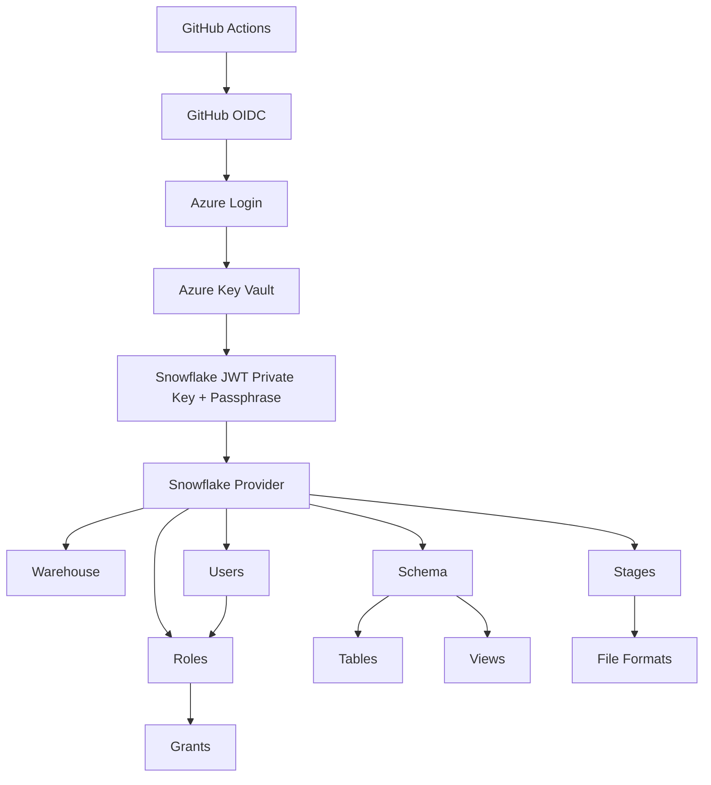

# Architecture Diagram

## What each component does

- GitHub Actions orchestrates CI/CD.
- GitHub OIDC removes the need for long-lived Azure secrets.
- Azure Key Vault stores the Snowflake private key pair securely.
- The Snowflake provider authenticates with a JWT.
- Warehouses provide compute resources.
- Schemas provide logical boundaries for objects.
- Tables and views represent the analytics layer.
- Stages and file formats support ingestion and file handling.
- Roles and grants enforce access control.

## Dependency flow

Warehouse -> Database (Data Source) -> Schema -> Tables -> Views
Stages -> File Formats -> Tables
Roles -> Grants -> Users
