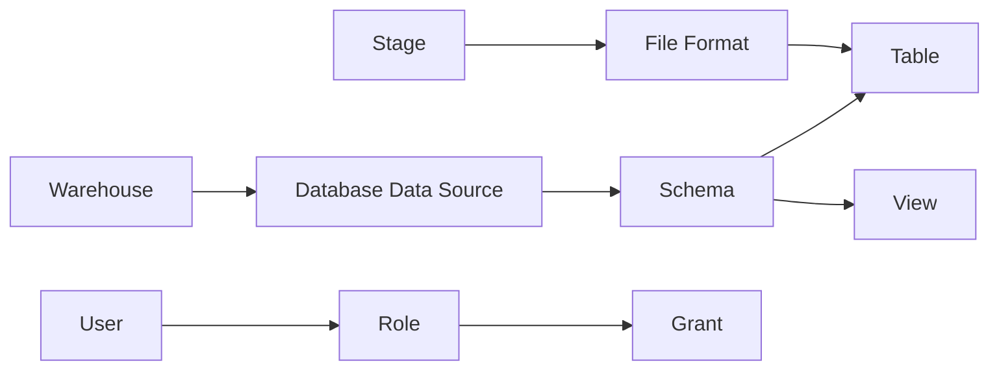

# Snowflake Object Relationship

## Relationship explanations

### Warehouse

Purpose:
- run Snowflake compute workloads

Dependencies:
- none beyond role and user access; often connected to a default warehouse assignment

### Database (Data Source)

Purpose:
- reference DBA-owned databases without creating them in Terraform

Dependencies:
- provider access and correct database name

### Schema

Purpose:
- logical grouping for tables, views, stages, and file formats

Dependencies:
- database must exist

### Tables

Purpose:
- persistent analytical storage

Dependencies:
- schema and column definitions

### Views

Purpose:
- logical or semantic layer over tables

Dependencies:
- table or dataset existence and valid SQL

### Stages

Purpose:
- unify ingestion sources such as internal, Azure, or S3 locations

Dependencies:
- storage integration and file format

### File Formats

Purpose:
- define how data is parsed or loaded

Dependencies:
- referenced by stage or load process

### Roles

Purpose:
- grant access boundaries and operational control

Dependencies:
- parent role inheritance and grant assignments

### Grants

Purpose:
- assign privileges to roles

Dependencies:
- roles, database, schema, and object names

### Users

Purpose:
- represent principals using the platform

Dependencies:
- default warehouse, role, and key configuration
