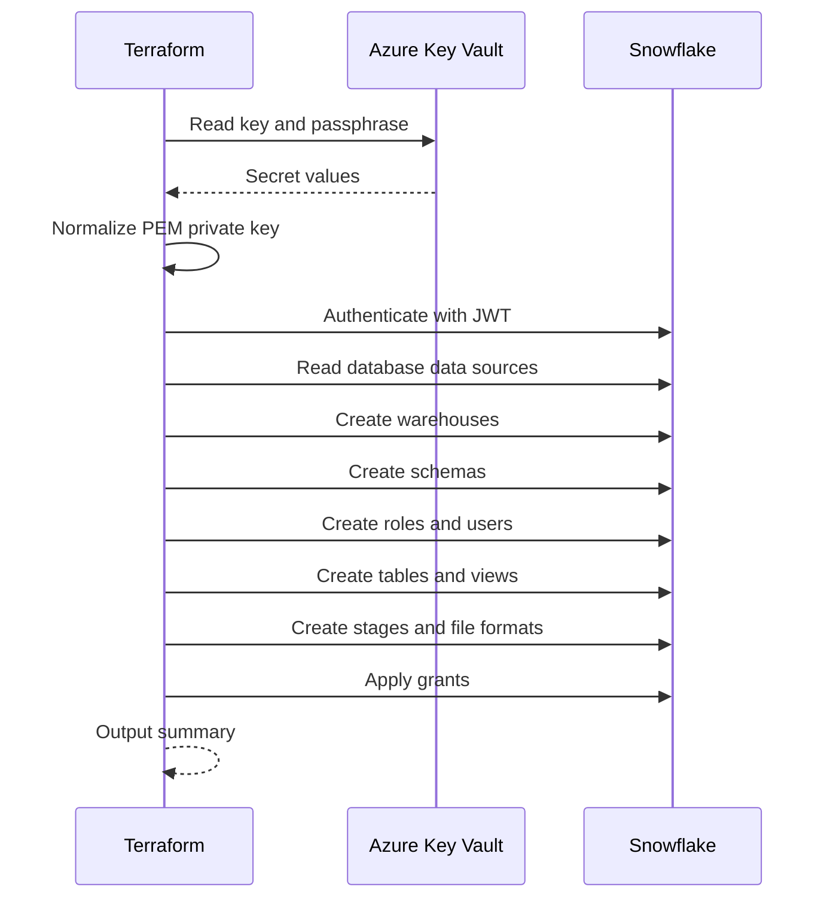

# Terraform Flow

1. Read Azure Key Vault secrets.
2. Normalize the Snowflake private key value for newline formatting.
3. Authenticate to Snowflake with `SNOWFLAKE_JWT`.
4. Read required Snowflake database data sources.
5. Create or update warehouses, roles, users, schemas, tables, and views.
6. Apply grants and stage/file format definitions.
7. Emit outputs for validation and downstream automation.

## Main execution order

